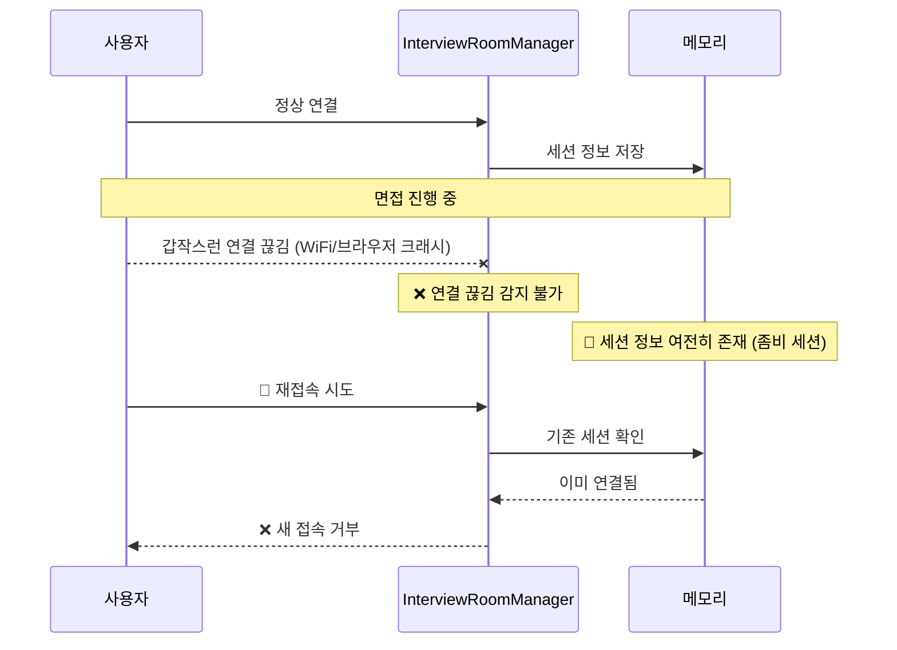
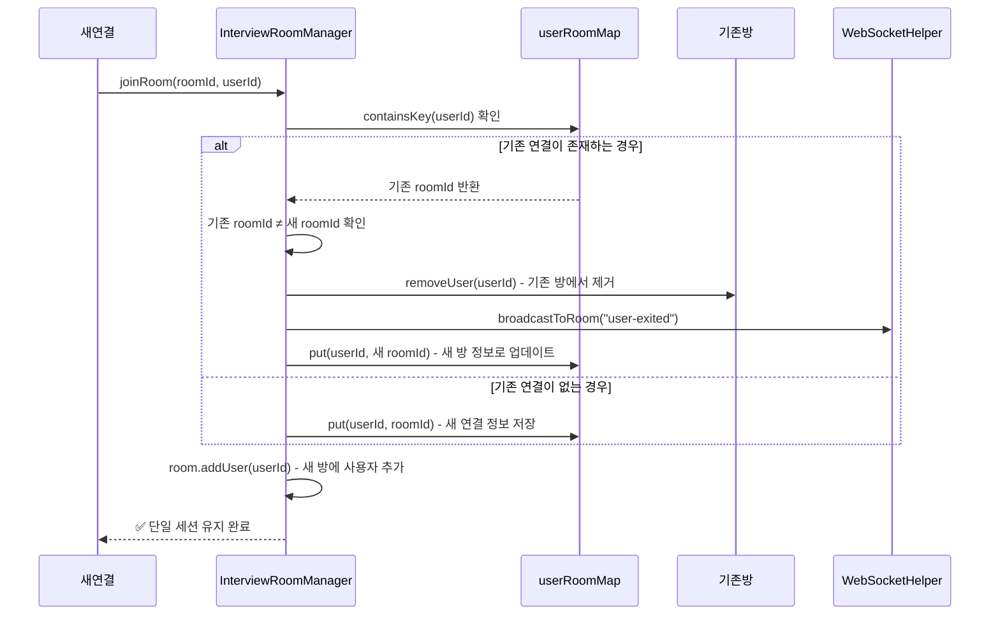
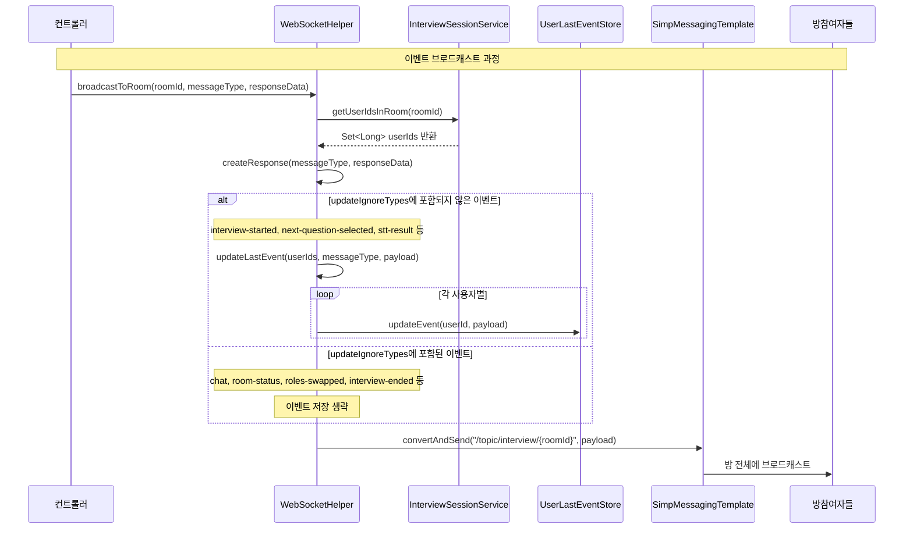
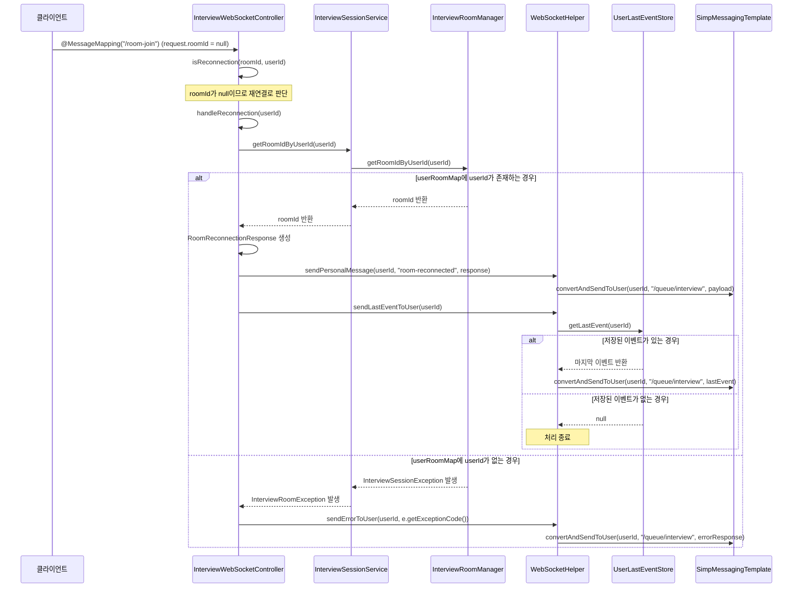
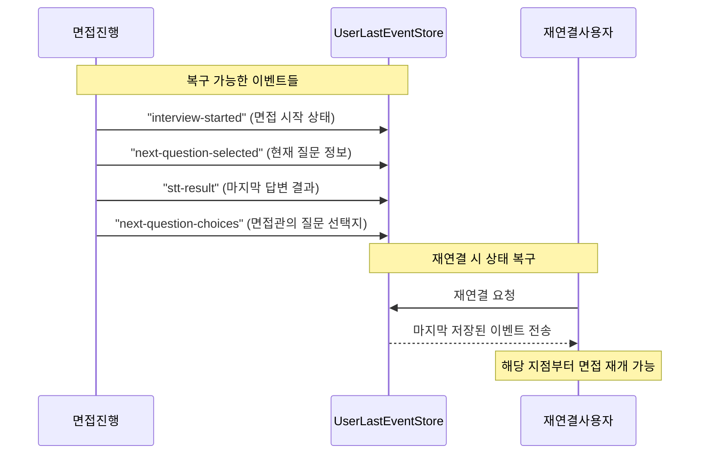
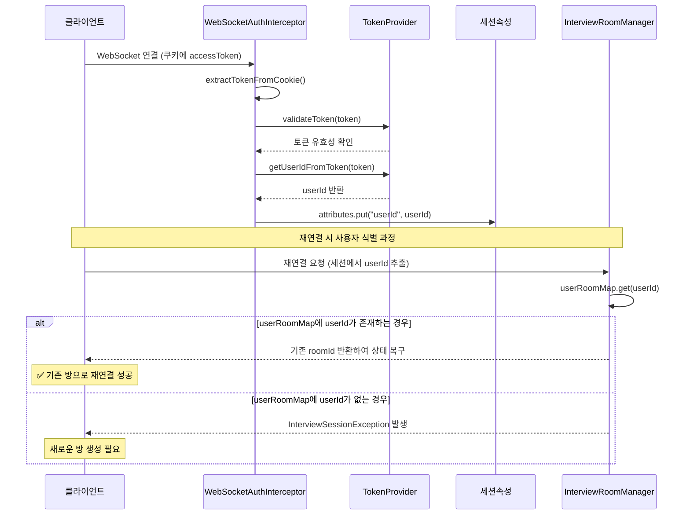
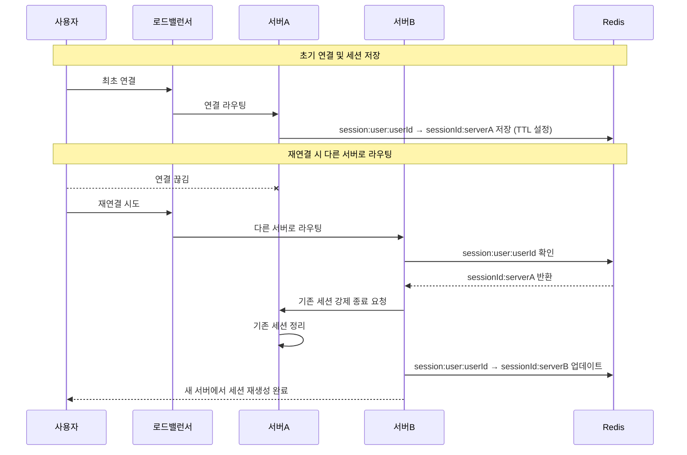
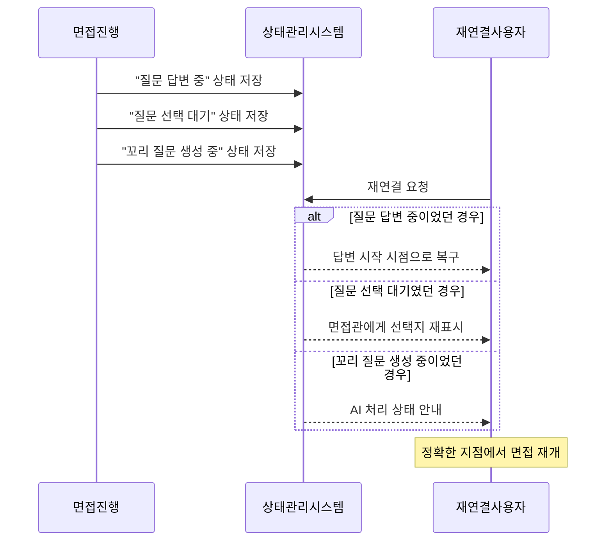
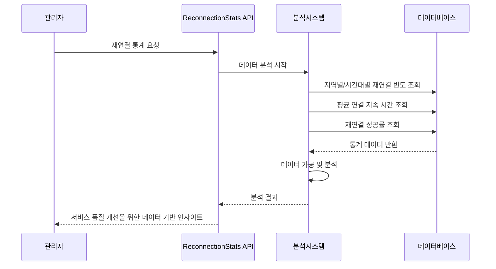

# 🔄 WebSocket 재연결 시스템 개발기

> 실시간 면접 서비스에서 마주한 연결 끊김 문제와 효율적인 재연결 시스템 설계 과정을 담았습니다.

## 🧭 프로젝트 배경

면접 연습 플랫폼 **kkori**를 개발하면서 WebSocket 기반 실시간 통신이 핵심 기능이었습니다. 
하지만 실제 면접 환경에서는 다양한 연결 끊김 상황이 발생할 수 있었고, 이를 안정적으로 처리하는 것이 중요한 과제였습니다.

### 직면한 문제들

#### 1. 예측할 수 없는 연결 끊김
- **네트워크 불안정**: WiFi 연결 끊김, 일시적인 인터넷 불안정
- **브라우저 이슈**: 크래시, 강제 종료, 시스템 재부팅
- **중복 접속**: 같은 사용자의 여러 탭 접속, 새로고침 시 세션 정리 미비

#### 2. 기존 시스템의 한계



**문제점**:
- 연결 끊김을 실시간으로 감지하지 못함
- 메모리와 실제 연결 상태의 불일치
- 중복 접속 방지 로직 부재

## 🧠 해결 방안 설계

### 1단계: 중복 접속 방지

기존 `InterviewRoomManager`의 `userRoomMap`을 활용하여 사용자별 단일 세션을 유지합니다.



### 2단계: 마지막 이벤트 추적과 재연결 처리

**핵심 아이디어**: 각 사용자에게 마지막으로 발생한 이벤트를 저장해두고, 재연결 시 해당 이벤트를 재전송하여 상태를 복구합니다.

#### UserLastEventStore 구현
```java
@Component
public class UserLastEventStore {
    private final Map<Long, Object> userLastEventMap = new ConcurrentHashMap<>();

    public void updateEvent(Long userId, Object newEvent) {
        userLastEventMap.put(userId, newEvent);
    }

    public Object getLastEvent(Long userId) {
        return userLastEventMap.get(userId);
    }
}
```

#### WebSocketHelper의 이벤트 추적



#### 재연결 플로우 구현



## 💡 핵심 설계 원칙

### 1. 상태 복구 우선주의
> **연결 유지보다 빠른 복구가 더 현실적이다**

전통적인 heartbeat/ping-pong 방식 대신, 재연결 시 즉시 상태를 복구하는 방식을 선택했습니다.

**장점**:
- 네트워크 오버헤드 최소화
- 구현 복잡도 감소
- 면접 세션의 짧은 지속 시간에 적합

### 2. 마지막 이벤트 기반 복구
각 사용자별로 마지막 중요 이벤트를 추적하여, 재연결 시 해당 지점부터 재개할 수 있도록 설계했습니다.



### 3. JWT 기반 사용자 식별
WebSocket 연결 시 JWT 토큰에서 추출한 userId를 세션에 저장하여 재연결 시 이전 세션을 특정할 수 있습니다.



## 📊 재연결 시나리오별 처리

### 시나리오 1: 네트워크 장애 후 재연결
1. 클라이언트 연결 끊김 감지
2. 자동 재연결 시도
3. `roomId = null`로 `/room-join` 요청
4. 서버에서 재연결로 인식하여 `handleReconnection()` 호출
5. 기존 방 정보와 마지막 이벤트 전송

### 시나리오 2: 브라우저 강제 종료 후 재접속
1. `SessionDisconnectEvent` 자동 발생으로 방에서 사용자 제거
2. 새 브라우저에서 재접속
3. JWT 토큰으로 동일 사용자 인증
4. `userRoomMap`에서 기존 방 정보 조회
5. 상태 복구 후 면접 계속 진행

### 시나리오 3: 중복 접속 시도
1. 새 탭/기기에서 동일 사용자 접속
2. `InterviewRoomManager.joinRoom()`에서 `userRoomMap` 확인
3. 기존 방에서 해당 사용자 제거 (`removeUser()`)
4. 새 방에 사용자 추가하여 단일 연결 유지

## 🚀 성과와 개선 효과

### 재연결 성공률 향상
- **기존**: 연결 끊김 시 수동으로 새 방 생성 필요
- **개선**: 자동 재연결로 기존 면접 세션 유지

### 네트워크 효율성
- **Heartbeat 미사용**: 지속적인 keep-alive 메시지 제거
- **On-demand 복구**: 필요할 때만 상태 정보 전송

### 사용자 경험 개선
- **투명한 재연결**: 사용자가 재연결 과정을 인지하지 못함
- **상태 일관성**: 면접 진행 상황 완벽 복구

## 🔮 향후 개선 방향

### 1. 서버 다중화 대응
현재는 단일 서버 환경을 가정하지만, 향후 스케일 아웃 시 고려사항:



### 2. 더 정교한 상태 관리
면접 세션의 미묘한 상태 변화까지 추적하여 완벽한 복구 제공:



### 3. 모니터링 및 분석
재연결 패턴 분석을 통한 서비스 품질 개선:



## 💭 마무리

WebSocket 기반 실시간 서비스에서 **"완벽한 연결 안정성"**을 추구하는 것보다 **"빠르고 투명한 재연결"**에 집중하는 것이 더 실용적임을 깨달았습니다.

특히 면접과 같은 짧은 시간의 중요한 세션에서는 복잡한 연결 유지 메커니즘보다는 **간단하고 확실한 상태 복구**가 사용자 경험에 더 큰 영향을 미쳤습니다.

이 설계는 kkori 프로젝트의 특성(JWT 인증, 짧은 세션, 이벤트 기반 진행)에 최적화된 솔루션이지만, 비슷한 실시간 서비스에서도 응용 가능한 패턴이라고 생각합니다.

---

> 🔗 관련 구현 파일:
> - `UserLastEventStore.java`: 사용자별 마지막 이벤트 추적
> - `WebSocketHelper.java`: 재연결 처리 및 이벤트 관리  
> - `InterviewWebSocketController.java`: 재연결 플로우 구현
> - `InterviewRoomManager.java`: 방 상태 관리 및 사용자 매핑
